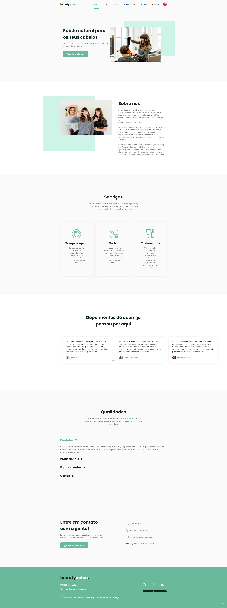

# BeautySalon

## 📝 Sobre

**BeautySalon** é um salão de beleza que oferece diversos serviços como cortes, tratamentos e terapia capilar.
  
O site **BeautySalon** é um projeto de website ensinado na NLW/Together na trilha origin, pelo Mayk Brito. O projeto aborda layout, estrutura html, pack de icons, estilização, reponsividade, animação no JS, entre outros.

Para completar o projeto adicionei algumas funções como: 
- Accordion list 
- Frase do dia (utilizando API adviceslip)
- Mudar a linguagem (pt-BR e en-US)
- Horário de funcionamento na sessão de contato que muda dependendo do dia/horario
- Data e horário atual no footer
- Slider para mudar cor do site
- Numero ficticio de clientes atuais na sessão de depoimentos

---------
---------

## 🖥️ Demonstração
  

## >>**[Clique aqui para acessar a demonstração do website](https://beautysalon-seven.vercel.app/)**<<

----------
----------

## 🚀 Tecnologias e ferramentas utilizadas

- **Figma**
- **HTML5**
- **CSS3**
- **JavaScript**

----
----

## 📝 Licença

O projeto está sob a licença MIT. Para saber mais, acesse o arquivo [LICENSE](https://github.com/RodrigoFonsecaG/bikcraft/blob/main/LICENSE).

---

**Desenvolvido por [Rodrigo Fonseca](https://github.com/RodrigoFonsecaG/).**
